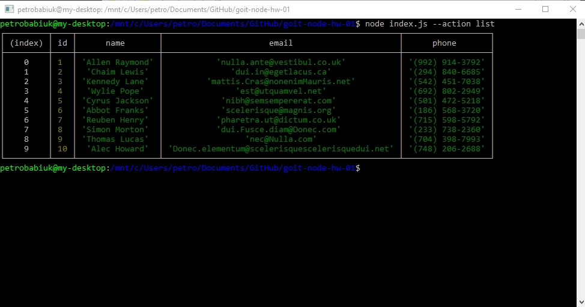
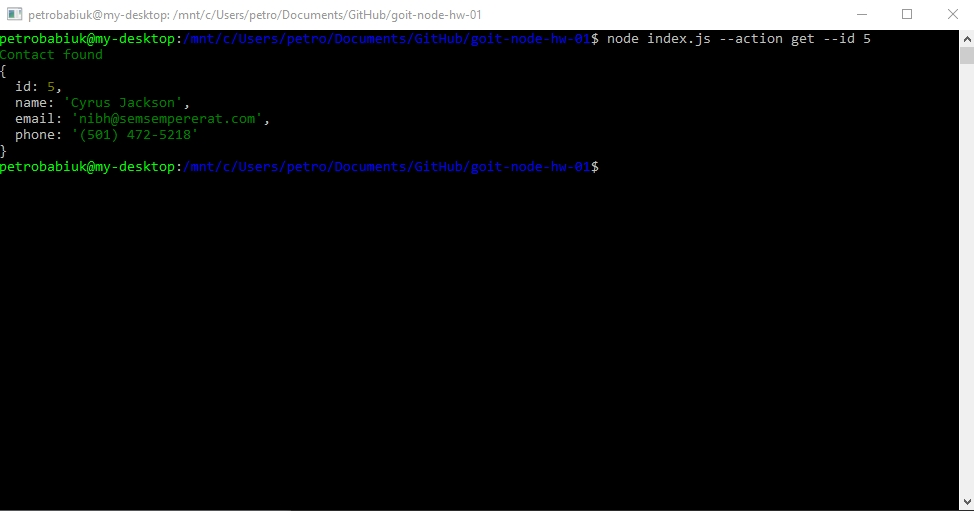
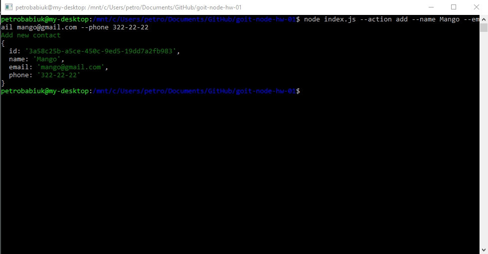
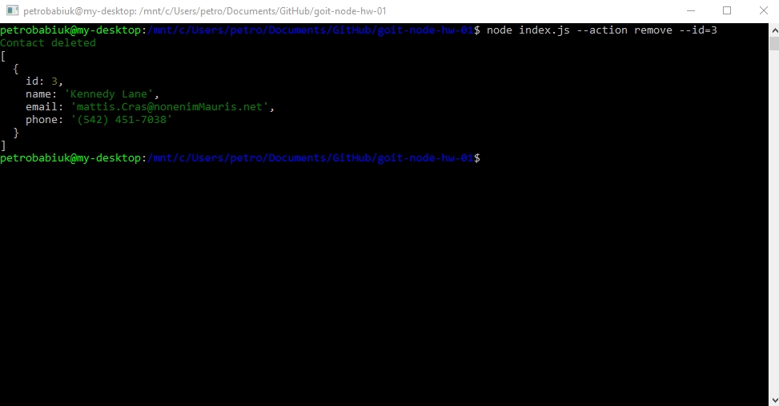

# Получаем и выводим весь список контактов в виде таблицы (console.table)

node index.js --action list

[list](http://joxi.ru/DrlYxV3HGDJOPm)

# Получаем контакт по id

node index.js --action get --id 5

[get](http://joxi.ru/v29Mbl8CRJOw82)

# Добавялем контакт

node index.js --action add --name Mango --email mango@gmail.com --phone 322-22-22

[add](http://joxi.ru/EA480vxCvYK5PA)

# Удаляем контакт

node index.js --action remove --id=3

[remove](http://joxi.ru/L211gbOuzBWNN2)
